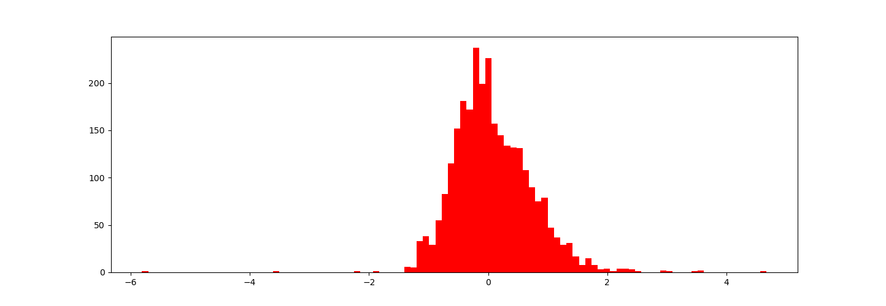
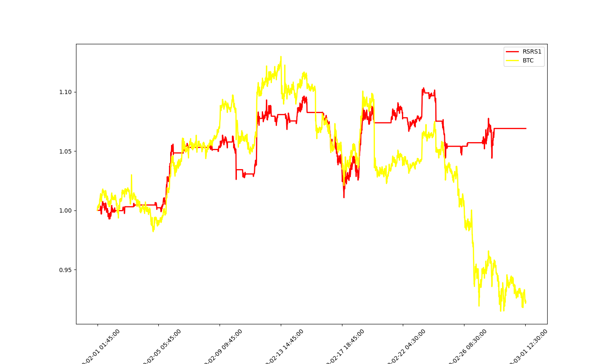

# Assignment3
Time Series Prediction
==
## Abstract
The use of resistance and support is mostly in the breakthrough strategy and reversal strategy, that is, if the price breaks through the resistance upward to catch up with the long, and breaks through the support downward to kill short; Or in the reversal strategy, if the price up close to resistance level short callback, down close to support level long rebound.This project aims to study the applicability of this index in BTC.
## Reference material
《20170501-光大证券-光大证券技术择时系列报告之一：基于阻力支撑相对强度（RSRS）的市场择时》
## Research process
### Data
We use the price of BTCUSDT from 2020-02-01 to 2020-03-01.
### Theory
Starting from the formation mechanism of the highest price and the lowest price, the daily highest price and the lowest price is a kind of resistance and support level, which is recognized by the trading behavior of all market participants on that day. Because we do not use support and resistance to break through or reverse trading threshold, but pay more attention to the consistency of market participants' positioning of resistance and support. The highest price and the lowest price of the day can quickly reflect the nature of the market's attitude towards resistance and support in the near future, which is the most important reason why we use the highest price and the lowest price.
We describe the relative strength of the support position and the resistance position by the degree of relative position change, i.e. the value similar to delta (high) /delta (low), that is, the range of the change of the highest price for every change of the lowest price. In fact, Delta (high) /delta (low) is the slope of connecting two points (low[0], high[0]) and (low[1], high[1]). Because of the noise of market volume price, the slope obtained by two points also contains too much noise. We consider using the recent n (low, high) data points to obtain the relative change degree of the highest lowest price with high signal-to-noise ratio. The natural idea is to use linear regression. If we build a linear model between the highest price and the lowest price as follows:
high = alpha + beta*low + epsilon， epsilon ~ N(0,sigma)

### Result

We use the mean and variance of Beta to decide buying and selling signals
We get

### Conclusion
From the results, RSRS has a good role in avoiding the downward trend。
You can get all of the result by running RSRS.py and using the data.
